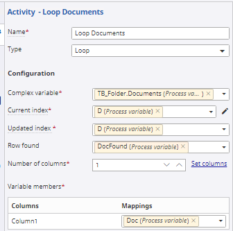
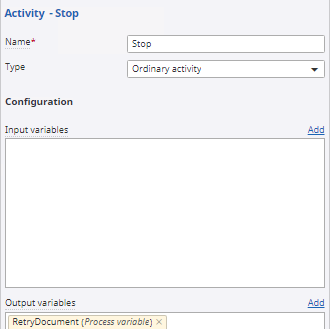
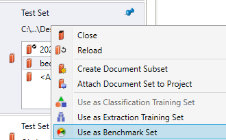
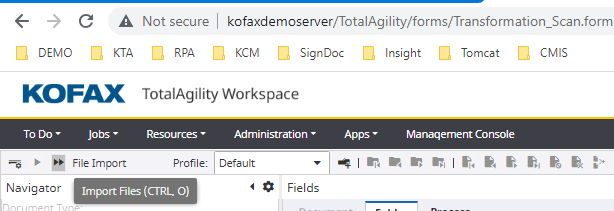
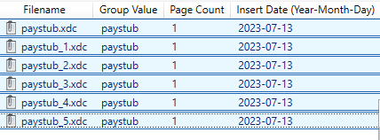

## Table Benchmarking in Kofax Total Agility.
This article shows you how to add a table benchmark to your Transformation Project. It uses the standard Extraction Benchmark. 
This process was designed for KTA, though it will also work in KTM and RPA.  
The benchmark looks like this:  

There are 5 Table Benchmark Fields  

* **TableRowCount** *This table has the correct number of rows =5.*
* **TableTotalPriceSum** *This table has the incorrect column sum of 0.00. it should have 8309.00.*
* **TableRowAlignment** *81% of the rows are aligned. Rows 1 & 4 are misaligned.*
* **TableColumnAlignment** *87% of the columns are aligned. Column 7 is misaligned.*
* **TableCells** *7 cells contain the wrong text.*

This example uses [this sample document].  The correct table seen below, but I manually removed 3 text lines from row 1 and 2 textlines from row 4, just to show how the benchmark works.

The **Automatic Table Locator** incorrectly reads the **Total Price** column, which is really useful for testing a benchmark!  

## The Overall Process.
*Here is an overview of each step, which is giving in detail later below.*
* Create a normal Transformation process in KTA.
* Make sure image processing is enabled if using PDF documents.
* Turn on online-learning.
* Add Activities for storing the original document name into the XDocument, so Transformation Designer can know the original file name.
* Collect sample documents. Load them into a test set in Transformation Designer. Convert this to a benchmark set. 
* Import your benchmark documents into KTA scan application.
* In KTA Validation validate your documents making sure that every field and table cell is perfect. Add the document to online-learning.
* In Transformation Designer import new training samples.
* Drag these new samples into a new test set.
* Add the [Table Benchmark Script](/KofaxTransformation/TableBenchmark/blob/main/tablebenchmark.md) to your project's class script.
* Extract (F6) your new samples. This will copy the truth into your benchmark training set.
* Run the Extraction Benchmark.
* If you made errors in the Benchmark files, then retry those files in KTA Validation and correct your errors.

## Add the Benchmark fields to your project
* Add all of the Table Metafields to your project.  

* Set the fields to be **Always Valid** so you can ignore them in Validation. You can also remove this fields from Validation form if you like.  

## Design your workflow in KTA
* Your workflow needs to include these steps.  

* you will need these variables.  

* You will need to lasso the documents in Validation to correct any extraction errors. You cannot lasso a PDF document, so add an **Image Processing** activity if you want to use PDF documents and their text layer.  

* Make sure that in the process settings, you are using PDF Text.  Click on blank-space in process map and Click "Capture" Settings. 

* After Classifying the documents you need to loop through all the documents and store the original filename into an **XValue** so that Kofax Transformation can find the original test document again.
* Add a **Loop** Activity over the documents called *Loop Documents*.  

* Add a **Decision** Activity called *Row Found?* where the true path goes to activity *Set filename*.  The false path continues on to the **Extract** Activity.

* The *Set filename* activity copies the imported filename (png or tiff) into the XDocument. it as a **.Net** Activity.  

* Add an **Ordinary activity** called *Stop* after the Validation activity. It is there for to keep the documents in KTA until we are certain that we correctly validated them. Leave the documents there until you have run the benchmark. One of the advantages of a benchmark is that it will show you when you incorrectly validated a document. It gives you the opportunity to send the documents BACK into Validation so that you can fix your validation mistakes without having to import the documents again.
* The *Stop* activity contains a check box called *Retry* which sends the documents back into Validation.  

* Add a **Branching Rule** to the *Stop* Activity in the *After processing* configuration.  

## Configure Transformation Designer
* Add the [Table_Benchmark script](https://github.com/KofaxTransformation/TableBenchmark/blob/main/tablebenchmark.md) to the class containing your table locator and 5 benchmark fields.
* Load docmuments into Transformation Designer and convert them to a Benchmark Set. 

## Create Truth Files
* Import your benchmark files into KTA Scan Job.  

* In KTA Validation make your tables Perfect. Use the add/delete/interpolate table row features.
* Add each document to online learning.
## Import into Transformation Designer
* Import new samples from KTA from Menu **Documents/DownloadNewSamples**.  

* You will see that they have the correct field and table values, but the table benchmark fields are incorrect.  

* These files cannot be extracted in this folder. Right-click on the documents and select **Open in Windows Explorer**. Copy them into a new folder call *truth files*.  

* Open this folder as a Document Set.  

* Extract the imported documents. This will add the perfect benchmark fields (100% match for everything) to the original XDoc that is in the benchmark set.
* reload the benchmark set.
* run the benchmark.
